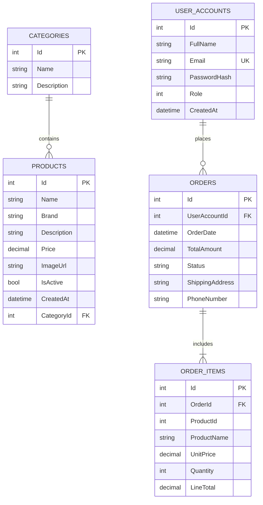

# NHEO Database ERD

## Overview

This ERD is based on the EF Core models in APP/PT_WEB/LaptopStoreWeb.

## Entity Relationship Diagram

## Notes

- Table names shown in uppercase map to EF entities:
  - USER_ACCOUNTS -> UserAccount
  - CATEGORIES -> Category
  - PRODUCTS -> Product
  - ORDERS -> Order
  - ORDER_ITEMS -> OrderItem
- Decimal precision configured in ApplicationDbContext:
  - Product.Price: decimal(18,2)
  - Order.TotalAmount: decimal(18,2)
  - OrderItem.UnitPrice: decimal(18,2)
  - OrderItem.LineTotal: decimal(18,2)
- Unique index:
  - UserAccount.Email is unique
- Enum/string domains:
  - UserAccount.Role: Customer (0), Admin (1)
  - Order.Status: New, Shipped, Paid
- OrderItem.ProductId is stored as a product reference field in the model.
